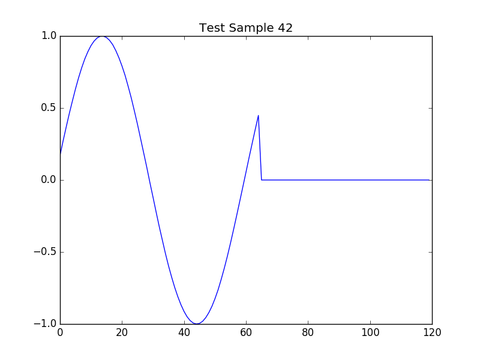

[HDFView]: https://support.hdfgroup.org/products/java/hdfview/
[HDF Group]: https://www.hdfgroup.org/
[h5py]: http://www.h5py.org
[FoundryDataBrowser]: https://github.com/ScopeFoundry/FoundryDataBrowser

The measurement will auto-save a data-file that contains the optimizer history to an HDF5 (.h5) data file within the specified Save Directory. This data file contains the data along with data structures that include all the meta-data from the microscope App. To view this data file, we can use a graphical viewer [HDFView], or use the [FoundryDataBrowser] from the ScopeFoundry project.

The [data file](./building_your_first_microscope_tutorial/1486144636_sine_wave_plot.h5) created by the `sine_wave_plot` measurement has the following hierarchy:

    |> app
        |- name = vfunc_gen_test_app
        |- ScopeFoundry_type = App
        |> settings
            |- save_dir = ~/fancy_microscope/data
            |- sample = Test Sample 42
            |> units
    |> hardware
        |- ScopeFoundry_type = HardwareList
        |> virtual_function_gen
            |- name = virtual_function_gen
            |- ScopeFoundry_type = Hardware
            |> settings
                |- connected = True
                |- debug_mode = False
                |- amplitude = 1.0
                |- rand_data = 0.5191185618096453
                |- sine_data = 0.9099735972719286
                |- square_data = -1.0
                |> units
    |> measurement
        |> sine_wave_plot
            |- name = sine_wave_plot
            |- ScopeFoundry_type = Measurement
            |D buffer: (120,) float64
            |> settings
                |- activation = False
                |- running = True
                |- progress = 50.0
                |- save_h5 = True
                |- sampling_period = 0.1
                |> units
                    |- progress = %
                    |- sampling_period = s

You will notice that this data file contains much more than just the sine wave data recorded during your measurement. It also contains all the settings of the hardware and measurement conditions at the time of the data acquisition. 


We can access this data file in Python using the [h5py] package.

```python
import h5py

dat = h5py.File('1486144636_sine_wave_plot.h5', 'r')

sample_name = dat['app/settings'].attrs['sample']
print(sample_name)
# Test Sample 42

buffer_data = dat['measurement/sine_wave_plot/buffer']

import matplotlib.pyplot as plt
plt.title(sample_name)
plt.plot( buffer_data)
plt.savefig('sine_wave_data_plot_42.png')
plt.show()
```

